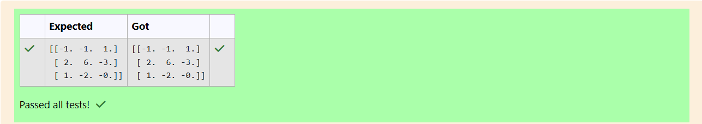

# INVERSE-OF-A-MATRIX
## Aim:
To write a python program to find the inverse of a matrix
## Equipment’s required:
1. 	Hardware – PCs
2. 	Anaconda – Python 3.7 Installation / Moodle-Code Runner
## Algorithm:
### Step1 : 
### Step 2: 
### Step 3: 
### Step 4: 

## Program:
```
#Program to find the inverse of a matrix.
#Developed by: Sharma R
#RegisterNumber: 24900539

import numpy as np

# Define the matrix
matrix = np.array([[6, 2, 3],
                   [3, 1, 1],
                   [10, 3, 4]])

# Compute the inverse
try:
    inverse_matrix = np.linalg.inv(matrix)
   
    print(inverse_matrix)
except np.linalg.LinAlgError:
    print("The matrix is singular and does not have an inverse.")
```
## Output:

## Result:
Thus the inverse of given matrix is successfully solved using python program

